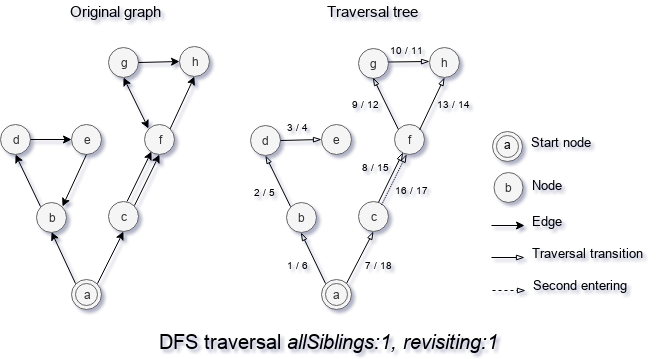
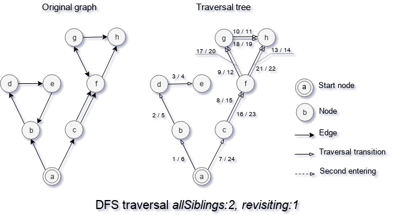

## Siblings strategy

The siblings strategy of a search algorithm is a strategy to handle multiple edges that connect pares of a parent and a child nodes.

There are multiple strategies for visiting a child node, which connects to the parent node by a few edges. Search option allSiblings manage search algorithms aspect of revisiting such nodes.

This strategy is an option for such search algorithms as DFS, BFS, CFS.

### AllSiblings : 0

You may see how DFS with siblings strategy `allSiblings : 0` works on the diagram "DFS traversal allSiblings:0, revisiting:1", where an original graph is on the left side and traversal tree of the graph on the right side. The [`revisiting`](./StrategyRevisiting.md) option uses to show difference in search algorithm.

With siblings strategy, `allSiblings : 0` search algorithm visit sibling nodes of the graph in order defined by the option `revisiting`, ignoring the fact that graph has multiple edges between parent node and child node. As you may see, second edge `cf` is never used, because algorithm treated two edges `cf` as one edge.

### AllSiblings : 1

You may see how DFS with allSiblings strategy `allSiblings : 1` works on the diagram "DFS traversal allSiblings:1, revisiting:1", where an original graph is on the left side and traversal tree of the graph on the right side. The `revisiting` option uses to show difference in search algorithm.

Siblings strategy `allSiblings : 1` allows algorithm revisit node of the graph if it has a few edges from the parent node. When the algorithm revisits child node, it continues in order defined by the option `revisiting` and takes into account the results of the previous traversal. As you may see, the algorithm revisits node `f` and get back to `c` because option `revisiting : 1` allows to revisit nodes only once.

### AllSiblings : 2

You may see how DFS with allSiblings strategy `allSiblings : 2` works on the diagram "DFS traversal allSiblings:2, revisiting:1", where an original graph is on the left side and traversal tree of the graph on the right side. The `revisiting` option uses to show difference in search algorithm.

Siblings strategy `allSiblings : 2` works similar to strategy `allSiblings : 1`, but when the algorithm revisits child node, it continues the traversal and ignores a value of the option `revisiting` and the results of the previous traversal. As you may see, the algorithm revisits node `f`, ignores option `revisiting : 1` and continues the traversal to nodes `g` and `h`. So implementation of search algorithm `allSiblings : 2` is the slowest and it is good for complete traversal of trees, graphs of which has multiple edges in pairs of nodes.

[Back to content](../README.md#Concepts)
