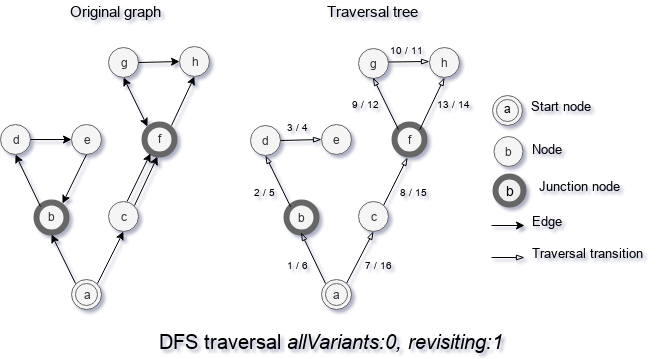
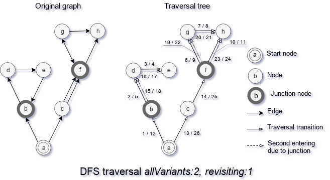

## Junction revisiting strategy

The junction revisiting strategy of a search algorithm is a strategy to handle junction nodes.

There are multiple strategies for visiting junction nodes. Search option allVariants manage search algorithms aspect of revisiting such nodes.

This strategy is an option for such search algorithms as DFS, BFS, CFS.

### AllVariants : 0

You may see how DFS with junction revisiting strategy `allVariants : 0` works on the diagram "DFS traversal allVariants:0, revisiting:1", where an original graph is on the left side and traversal tree of the graph on the right side. The [`revisiting`](./StrategyRevisiting.md) option uses to show difference in search algorithm.

With junction revisiting strategy, `allVariants : 0` search algorithm does not change traversal of the graph and continues it in the order defined by the options `revisiting` and [`allSiblings`](./StrategyAllSiblings.md), ignoring the fact that graph has junction nodes. As you may see, after the walk `bde` algorithm does not visit node `f` and continues the walk to node `c`. After node `f` is reached, the algorithm not traverse branch `bde`, but continues walk to nodes `g` and `h`.

### AllVariants : 1

You may see how DFS with junction revisiting strategy `allVariants : 1` works on the diagram "DFS traversal allVariants:1, revisiting:1", where an original graph is on the left side and traversal tree of the graph on the right side. The `revisiting` option uses to show difference in search algorithm.

Junction revisiting strategy `allVariants : 1` allows algorithm revisit junction nodes of the graph. When the algorithm revisits junction node, it continues in order defined by the option `revisiting` and takes into account the results of the previous traversal. As you may see, after the walk `bde` the algorithm visits node `f` and traverse nodes `g` and `h`. When algorithm reaches node `f` repeatedly, it get back because option `revisiting : 1` allows to revisit node only once.

### AllVariants : 2

You may see how DFS with junction revisiting strategy `allVariants : 2` works on the diagram "DFS traversal allVariants:2, revisiting:1", where an original graph is on the left side and traversal tree of the graph on the right side. The `revisiting` option uses to show difference in search algorithm.

Junction revisiting strategy `allVariants : 2` works similar to strategy `allVariants : 1`, but when the algorithm revisits junction node, it continues the traversal and ignores a value of the option `revisiting` and the results of the previous traversal. As you may see, after the walk `bde` the algorithm visits node `f` and traverse nodes `g` and `h`. When algorithm reaches node `f` repeatedly, it traverses branch `bde` and visits nodes `g` and `h` repeatedly. So implementation of search algorithm `allVariants : 2` is the slowest and it is good for complete traversal of trees, graphs of which has junction nodes.

[Back to content](../README.md#Concepts)
